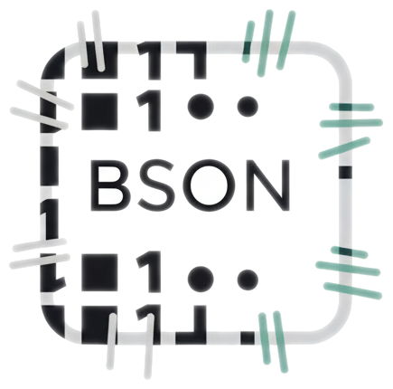

 

# BSON Patch

This is an implementation of [RFC 6902 JSON Patch](https://datatracker.ietf.org/doc/html/rfc6902) written in Java with extended BSON pointers.

This [JSON Patch](http://jsonpatch.com) implementation works directly with [BSON documents](http://bsonspec.org/) using the [MongoDB Java driver implementation of BSON](https://www.mongodb.com/json-and-bson). 

The code here was forked (copied, renamed, repackaged, modified) from [eBay bsonpatch project](https://github.com/eBay/bsonpatch) which, in turn, was ported (forked, renamed, repackaged, modified) from the [zjsonpatch project](https://github.com/flipkart-incubator/zjsonpatch).

[]() []() [
]() []()

 [](https://github.com/bsonpatch/bsonpatch/stargazers)
[](https://github.com/bsonpatch/bsonpatch/issues)
[](https://github.com/bsonpatch/bsonpatch/commits)
[](https://github.com/bsonpatch/bsonpatch/releases/latest)
[](https://github.com/bsonpatch/bsonpatch/releases)
[](https://github.com/bsonpatch/bsonpatch/releases)

## Description & Use-Cases
- Java Library to find / apply JSON Patches according to [RFC 6902](https://datatracker.ietf.org/doc/html/rfc6902).
- JSON Patch defines a JSON document structure for representing changes to a JSON document.
- It can be used to avoid sending a whole document when only a part has changed, thus reducing network bandwidth requirements if data (in JSON format) is required to send across multiple systems over network or in case of multi DC transfer.
- When used in combination with the HTTP PATCH method as per [RFC 5789 HTTP PATCH](https://datatracker.ietf.org/doc/html/rfc5789), it will do partial updates for HTTP APIs in a standard way.
- Extended JSON pointer functionality (i.e. reference array elements via a key): `/array/id=123/data`
    - The user has to ensure that a unique field is used as a reference key. Should there be more than one array
      element matching the given key-value pair, the first element will be selected.
    - Key based referencing may be slow for large arrays. Hence, standard index based array pointers should be used for large arrays.
- This library compares two [BsonValue](https://mongodb.github.io/mongo-java-driver/3.12/javadoc/org/bson/BsonValue.html) inputs and produces a [BsonArray](https://mongodb.github.io/mongo-java-driver/3.12/javadoc/org/bson/BsonArray.html) of the changes.


### Compatible with : Java 8 and above all versions

## Complexity
- To find JsonPatch : Ω(N+M), N and M represents number of keys in first and second JSON respectively / O(summation of la*lb) where la , lb represents JSON Array of length la / lb of against same key in first and second JSON ,since LCS is used to find difference between 2 JSON arrays there of order of quadratic.
- To Optimize Diffs ( compact move and remove into Move ) : Ω(D) / O(D*D) where D represents number of diffs obtained before compaction into Move operation.
- To Apply Diff : O(D) where D represents number of diffs

### How to use:

### Current Version : ${version.coordinate}

Add following to `<dependencies/>` section of your pom.xml -

```xml
<dependency>
  <groupId>io.github.bsonpatch</groupId>
  <artifactId>bsonpatch</artifactId>
  <version>${version.coordinate}</version>
</dependency>
```

## API Usage

### Obtaining Json Diff as patch
```xml
BsonArray patch = BsonDiff.asBson(BsonValue source, BsonValue target)
```
Computes and returns a JSON `patch` (as a BsonArray) from `source`  to `target`,
Both `source` and `target` must be either valid BSON objects or arrays or values. 
Further, if resultant `patch` is applied to `source`, it will yield `target`.

The algorithm which computes this JsonPatch currently generates following operations as per [RFC 6902](https://datatracker.ietf.org/doc/html/rfc6902#section-4) -  
 - `add`
 - `remove`
 - `replace`
 - `move`
 - `copy`
 
### Apply Json Patch
```xml
BsonValue target = BsonPatch.apply(BsonArray patch, BsonValue source);
```
Given a `patch`, apply it to `source` Bson and return a `target` Bson which can be ( Bson object or array or value ). This operation  performed on a clone of `source` Bson ( thus, `source` Bson is untouched and can be used further). 

 ## To turn off MOVE & COPY Operations
```xml
EnumSet<DiffFlags> flags = DiffFlags.dontNormalizeOpIntoMoveAndCopy().clone()
BsonArray patch = BsonDiff.asJson(BsonValue source, BsonValue target, flags)
```

### Example
First Json
```json
{"a": 0,"b": [1,2]}
```

Second json ( the json to obtain )
```json
 {"b": [1,2,0]}
```
Following patch will be returned:
```json
[{"op":"move","from":"/a","path":"/b/2"}]
```
here `"op"` represents the operation (`"move"`), `"from"` represent path from where value should be moved, `"path"` represents where value should be moved. The value that is moved is taken as the content at the `"from"` path.

### Extended JSON Pointer Example
JSON
```json
{
  "a": [
    {
      "id": 1,
      "data": "abc"
    },
    {
      "id": 2,
      "data": "def"
    }
  ]
}
```

JSON path
```jsonpath
/a/id=2/data
```

Following JSON would be returned
```json
"def"
```

### Apply Json Patch In-Place
```xml
BsonPatch.applyInPlace(BsonArray patch, BsonValue source);
```
Given a `patch`, it will apply it to the `source` BSON mutating the instance, opposed to `BsonPatch.apply` which returns 
a new instance with the patch applied, leaving the `source` unchanged.

This is an extension to the RFC, and has some additional limitations. Specifically, the source document cannot be fully change in place. This means the following operations are not supported:
* `remove` with an empty or root path;
* `replace` with an empty or root path;
* `move`, `add` or `copy` targeting an empty or root path.

### Tests:
1. 100+ selective hardcoded different input JSONs , with their driver test classes present under /test directory.
2. Apart from selective input, a deterministic random JSON generator is present under ( TestDataGenerator.java ),  and its driver test class method is JsonDiffTest.testGeneratedJsonDiff().

#### *** Tests can only show the presence of bugs and not their absence ***

## Get Involved

* **Contributing**: Pull requests are welcome!
  * Read [`CONTRIBUTING.md`](CONTRIBUTING.md) 
  * Submit [github issues](https://github.com/bsonpatch/bsonpatch/issues) for any feature enhancements, bugs or documentation problems
    
* **Support**: Questions/comments can posted as [github issues](https://github.com/bsonpatch/bsonpatch/issues)

## Maintainers

* [Dan Douglas](https://github.com/dandoug) 
